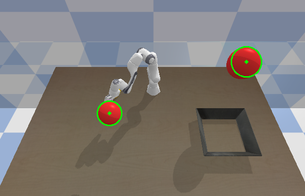

# Intelligent Robotic Manipulation (WiSe 2024/25) - Final Project

### Student 1: Daniel Bellardi Kerzner - XXXXXX
### Student 2: Matheus Latorre Cavini - 2261960 


## Brief Introduction to the Project

The overall goal of the project consists in perfoming a task of grasping, transporting and placing a object in a simulated environment, using a 7-DOF robotic arm. 

The simulation, as well as all the code implemented for the task, shall be done in Python language, employing the `pybullet` library, which offers support for robotics simulation. 

The elements of the simulation are:
- A table 
- A Franka robot arm placed on top of the table always at a fixed position.
- An object from the YCB dataset, which is spawned at region of the table which some randomness on its position and orientation.
- A basket placed on the oposite side of the table always at a fixed position.
- Two spherical moving obstacles above the table, following a linear trajectory with random jittering.
- Two RGB-D cameras, which provide color, depth and also segmentation information, being one placed at the end effector of the robot arm, and other placed above the table.

The general outline for the tasks that should be performed in order to achive the overall goal are:
1. **Perception:** estimate the 6D pose of the object to be grasped.
2. **Control**: control robot arm end effector pose using one of the avaiable Jacobian methods.
3. **Grasping:**: sample and perform a proper grasp to firmly catch the object.
4. **Localization and Tracking**: use computer vision and tracking methods avaiable to keep track of the obstacles positions at the environment.
5. **Planning**: plan a trajectory to carry the grasped object to the basket, taking in account obstacle positions, in order to avoid collisions.

All of the tasks shall be performed using sensing information provided only by the 2 cameras and the internal sensors of the robot (joint positions, velocities, etc.), that meaning no ground truth information about object or obstacles is avaiable.

## Task 1: Perception

## Task 2: Control

To perform the pose control for the robot end effector, the method applied was the **Pseudoinverse of Jacobian** [see 1]. This control method is described by the law:

$$ \Delta \theta =  \text{J}^{\dagger}\cdot \Delta p  $$

Where:
- $\Delta p$ is the difference from the desired to the current 6D pose of end effector.
- $\text{J}^{\dagger}$ is the pseudoinverse of the jacobian matrix for the current joint configuration of the robot.
- $\Delta \theta$ is the position variation that should be applied to joints, given as a $N$-dimensional vector, where $N$ is the number of active joints.

In order to implement this controller in code, a method for the already existing class `Robot` was created named `IK_Solver`, which takes as argument the desired pose of the end effector and returns the new joint position. It makes use of a helping method, `compute_pose_error`, which as the name suggests, calculate the error between the desired and current pose. Lastly, the method `move_to_pose` uses the `IK_Solver` together with the already existing `position_control` to move the joints.


```Python
def compute_pose_error(self, target_pos, current_pos, target_ori, current_ori):
    position_error = np.array(target_pos) - np.array(current_pos)
    orientation_error_quat = p.getDifferenceQuaternion(current_ori, target_ori)
    orientation_error = 2 * np.array(orientation_error_quat[:3])  # Extract vector part
    
    return np.hstack((position_error, orientation_error))


def IK_solver(self, target_pos, target_ori):
    #Calculate the error DeltaP between the current and desired end effector pose
    current_ee_pos, current_ee_ori = self.get_ee_pose()
    joint_positions = self.get_joint_positions()
    joint_velocities = self.get_joint_velocites()
    error = self.compute_pose_error(target_pos, current_ee_pos, target_ori, current_ee_ori)

    #If position error is small enough, stop updating joint positions
    if np.linalg.norm(error[:3]) < 0.01 and np.linalg.norm(error[4:]) <0.01:
            return joint_positions
        

    #Calculate the Jacobian
    zeros = np.zeros(len(joint_positions))
    jacobian_linear, jacobian_angular = p.calculateJacobian(
        self.id, 
        self.ee_idx,
        localPosition=[0, 0, 0], 
        objPositions=joint_positions.tolist()+[0,0],   
        objVelocities=joint_velocities.tolist()+[0,0], 
        objAccelerations=zeros.tolist()+[0,0]
    )
    jacobian = np.vstack((jacobian_linear, jacobian_angular))[:, :7]

    #Calculate the pseudo-inverse of the Jacobian
    jacobian_pseudo_inv = np.linalg.pinv(jacobian)

    #Calculate joint_increment DeltaTheta
    delta_theta = jacobian_pseudo_inv @ error

    #Update the joint positions
    joint_positions += delta_theta

    return joint_positions


def move_to_pose(self, target_pos, target_ori):
    joint_postions = self.IK_solver(target_pos, target_ori)
    self.position_control(joint_postions)
```

## Task 3:

## Task 4: Localization and Tracking
In order to localize and track obstacle positions in 3D global coordinate system, three subtasks had to be performed:
1. Detecting all red circles in the image of the static camera, along with its center coordinates in image frame.
2. Converting the position of the circles (obstacles) in the image to global frame, by using camera projection and view matrices, getting a 3D measure.
3. Perform a Kalman Filter with the measures obtained to finally estimate and track obstacle positions real-time.

Each one of this subtasks is detailed bellow.

### Circle Detection in Image
Circle detection was fully performed using OpenCV2 library form Python [see 2].

The steps for detecting the red circles (which correspond to the obstacles) in the image of the static camera are first create a binary mask for the pixels matching a range of HSV values of red color. This binary mask is then dilated, eroded and filtered with a gaussian filter, so that border irregularities and noise is removed. Lastly, the circles are detected using built-in function `cv2.HoughCircles()`, and their information are stored in a list which is returned by the function.

```py
def detect_obstacle_2D(image):
    #Convert the numpy image from camera to HSV color space
    hsv = cv2.cvtColor(image, cv2.COLOR_RGB2HSV)

    #Define the HSV values range for red (obstacle color)
    lower_red1 = np.array([0, 100, 100])
    upper_red1 = np.array([10, 255, 255])
    lower_red2 = np.array([160, 100, 100])
    upper_red2 = np.array([180, 255, 255])

    #Create binary masks for red color in image 
    mask1 = cv2.inRange(hsv, lower_red1, upper_red1)
    mask2 = cv2.inRange(hsv, lower_red2, upper_red2)
    mask = cv2.bitwise_or(mask1, mask2)

    #Apply dilation and erosion step to decrease border irregularities
    kernel = np.ones((5, 5), np.uint8)
    dilated = cv2.dilate(mask, kernel, iterations=1)
    eroded = cv2.erode(dilated, kernel, iterations=1)

    #Apply GaussianBlur to reduce noise
    blurred = cv2.GaussianBlur(eroded, (9, 9), 2)

    # Detect circles using HoughCircles
    circles = cv2.HoughCircles(blurred, cv2.HOUGH_GRADIENT, dp=1.2, minDist=100, param1=50, param2=30, minRadius=10, maxRadius=0)

    #Initialize list to store circle information
    circle_info = [] #stores (x,y) coordinates of the center and radius r

    if circles is not None:
        circles = np.round(circles[0, :]).astype("int")
        for (x, y, r) in circles:
            circle_info.append((x, y, r))
            # Draw the circle in the original image in gree
            cv2.circle(image, (x, y), r, (0, 255, 0), 2)
            cv2.circle(image, (x, y), 2, (0, 255, 0), 3)
    
    #DEBUG: Display the image with highlighted circles
    cv2.imshow("Detected Red Circles", cv2.cvtColor(image, cv2.COLOR_RGB2BGR))
    cv2.waitKey(1)

    #return circle info ordered by y coordinate
    return sorted(circle_info, key=lambda c: c[1]) 
```


### Conversion to Global Coordinates
To convert the coordinates of the obstacles in the image frame to their coordinates in global 3D frame, the data from camera Projection Matrix, View Matrix and also the depth map of the image are needed.

The fisrt step is transforming the depth map (which contains values ranging from 0 to 1) into the effective real distances from the camera to that pixel, which is done by the function bellow:

```py
def real_depth(depth, near, far):
    #Near and Far are camera parameters
    depth_real = 2 * far * near / (far + near - (2 * depth - 1) * (far - near))
    return depth_real
```

Then, a second function takes the circle information, a the real depth map and the camera matrices and apply the inverse projective transformation to get the real world coordinates [see 3].

```py
def obstacle_3D_estimator(circle_info, depth_real, projection_matrix, view_matrix, obstacle_idx):
    if len(circle_info) <= obstacle_idx:
        return np.array([0, 0, 0])
    
    x, y, r = circle_info[obstacle_idx]
    projection_matrix = np.array(projection_matrix).reshape(4,4)
    view_matrix = np.array(view_matrix).reshape(4, 4).T

    h, w = depth_real.shape
    
    #Extract PyBullet projection matrix parameters
    fx = projection_matrix[0, 0] * w / 2
    fy = projection_matrix[1, 1] * h / 2
    cx = (1 - projection_matrix[0, 2]) * w / 2
    cy = (1 + projection_matrix[1, 2]) * h / 2

    #Get depth value for obstacle center at (x, y)
    depth_value = depth_real[int(y), int(x)]

    #Convert to camera coordinates
    Z = depth_value
    X = (x - cx) * Z / fx
    Y = (y - cy) * Z / fy

    #Refine estimation including radius information
    x1 = (x+r - cx)* Z / fx
    x2 = (x-r - cx)* Z / fx
    R = np.abs((x1-x2))/2 #Radius in meters
    Z = Z + R
    X = (x - cx) * Z / fx
    Y = (y - cy) * Z / fy
    
    #Create homogeneous coordinate vector
    P_cam = np.array([X, Y, Z]).reshape(-1, 3)
    P_cam_homogeneous = np.append(P_cam, 1).reshape(4, 1)

    #Define a camera transfomation matrix
    transformation_matrix = np.array([[1, 0, 0, 0],
                                    [0, -1, 0, 0],
                                    [0, 0, -1, 0],
                                    [0, 0, 0, 1]])

    #Apply the transformation
    P_cam_transformed = np.dot(transformation_matrix, P_cam_homogeneous)
    P_cam_transformed = P_cam_transformed.reshape(4,1)
    
    #Compute the inverse view matrix
    V_inv = np.linalg.inv(view_matrix)
    
    #Transform to world coordinates
    P_world = (V_inv @ P_cam_transformed)
    
    # Return only (x, y, z) world coordinates
    return (P_world[:3]/P_world[3]).flatten()
``` 

### Kalman Filter
**TO DO...**

## References
[1] Buss, Samuel R. "Introduction to inverse kinematics with jacobian transpose, pseudoinverse and damped least squares methods." IEEE Journal of Robotics and Automation 17.1-19 (2004): 16.

[2] Hough Circle transform. OpenCV. (n.d.). https://docs.opencv.org/3.4/d4/d70/tutorial_hough_circle.html

[3] PyBullet Quickstart Guide. PyBullet. https://docs.google.com/document/d/10sXEhzFRSnvFcl3XxNGhnD4N2SedqwdAvK3dsihxVUA/edit?tab=t.0